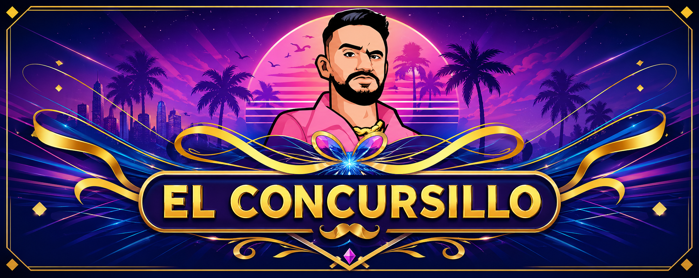

# 🎮 El Concursillo



## 📌 Descripción del proyecto

**El Concursillo** es una aplicación desarrollada en **Java** que simula un juego de preguntas y respuestas inspirado en el formato de **“¿Quién quiere ser millonario?”**, pero adaptado con una estética propia y temática basada en el estilo del streamer **IlloJuan**.

El proyecto forma parte de un trabajo académico en el que se ponen en práctica conocimientos de varias asignaturas, principalmente:

- Programación
- Bases de Datos
- Entornos de Desarrollo
- Digitalización y Sostenibilidad

La aplicación permite iniciar una partida, responder preguntas de dificultad progresiva, usar comodines, plantarse, acumular dinero ficticio y guardar la puntuación final en una base de datos.

---

## 🧠 Objetivo del juego

El objetivo principal es responder correctamente a una serie de preguntas de opción múltiple.

Cada pregunta tiene **cuatro respuestas posibles**:

- A
- B
- C
- D

Solo una de ellas es correcta.

El jugador debe avanzar pregunta a pregunta, acumulando dinero según el número de aciertos. También puede utilizar comodines para recibir ayuda o decidir plantarse para conservar el dinero acumulado hasta ese momento.

---

## 🎯 Características principales

- Juego de preguntas y respuestas con dificultad progresiva.
- Preguntas almacenadas en una base de datos **MongoDB**.
- Sistema de niveles.
- Sistema de premios acumulados.
- Opción de plantarse.
- Comodines especiales.
- Ranking de puntuaciones.
- Interfaz gráfica en Java.
- Pruebas por consola para comprobar la lógica del juego.
- Organización del código por paquetes.
- Uso de Git y GitHub para el control de versiones.

---

## 🕹️ Funcionamiento general

El flujo básico de una partida es el siguiente:

1. El jugador introduce su nombre.
2. Se crea una nueva partida.
3. El programa carga una pregunta desde MongoDB.
4. Se muestran el enunciado y las cuatro respuestas posibles.
5. El jugador elige una respuesta.
6. El programa comprueba si la respuesta es correcta.
7. Si acierta, avanza a la siguiente pregunta y aumenta su premio.
8. Si falla, la partida termina.
9. El jugador puede plantarse para conservar el dinero acumulado.
10. Al finalizar, la puntuación se guarda en la base de datos.
11. El ranking muestra las mejores puntuaciones.

---

## 🧩 Comodines del juego

Durante la partida, el jugador puede utilizar diferentes comodines.

### 50:50

Elimina dos respuestas incorrectas, dejando visible la respuesta correcta y una opción incorrecta.

### Comodín del Chat / Público

Simula la ayuda del público o del chat, mostrando una posible respuesta recomendada.

### Comodín de la Llamada

Simula una llamada de ayuda, dando una posible pista sobre la respuesta correcta.

### Comodín del Sacrificio

Comodín especial que permite recibir ayuda a cambio de una consecuencia dentro del juego.

### Comodín de la Ruleta

Lanza una ruleta que puede provocar distintos efectos sobre las respuestas disponibles.

### Comodín del Mago

Permite cambiar la pregunta actual por otra pregunta diferente del mismo nivel o dificultad.

---

## 🏆 Sistema de premios

El juego utiliza una escala de premios progresiva.  
Cada respuesta correcta aumenta el dinero acumulado del jugador.

Ejemplo de premios:

| Pregunta | Premio |
|---------:|-------:|
| 1 | 100 € |
| 2 | 250 € |
| 3 | 500 € |
| 4 | 750 € |
| 5 | 1.500 € |
| 6 | 2.500 € |
| 7 | 5.000 € |
| 8 | 10.000 € |
| 9 | 20.000 € |
| 10 | 30.000 € |
| 11 | 50.000 € |
| 12 | 100.000 € |
| 13 | 300.000 € |
| 14 | 500.000 € |
| 15 | 1.000.000 € |

---

## 🗃️ Base de datos

El proyecto utiliza **MongoDB** como sistema de base de datos.

### Base de datos principal

```text
millonarioDB
```

### Colecciones utilizadas

```text
preguntas
puntuaciones
```

---

## ❓ Estructura de una pregunta

Cada pregunta almacenada en MongoDB tiene una estructura similar a esta:

```json
{
  "pregunta": "¿Cuál es la capital de España?",
  "opcionA": "Barcelona",
  "opcionB": "Madrid",
  "opcionC": "Valencia",
  "opcionD": "Sevilla",
  "correcta": "B",
  "nivel": 1,
  "pista": "Es donde está el gobierno",
  "categoria": "Geografía"
}
```

### Campos de la colección `preguntas`

| Campo | Descripción |
|------|-------------|
| `pregunta` | Enunciado de la pregunta |
| `opcionA` | Primera respuesta posible |
| `opcionB` | Segunda respuesta posible |
| `opcionC` | Tercera respuesta posible |
| `opcionD` | Cuarta respuesta posible |
| `correcta` | Letra de la respuesta correcta |
| `nivel` | Nivel de dificultad |
| `pista` | Ayuda o pista de la pregunta |
| `categoria` | Categoría temática |

---

## 🏅 Estructura de una puntuación

La colección `puntuaciones` guarda los resultados de los jugadores.

Ejemplo:

```json
{
  "nombreJugador": "Paula",
  "dineroAcumulado": 10000,
  "preguntasAcertadas": 8
}
```

### Campos principales

| Campo | Descripción |
|------|-------------|
| `nombreJugador` | Nombre del jugador |
| `dineroAcumulado` | Dinero conseguido al terminar la partida |
| `preguntasAcertadas` | Número de preguntas respondidas correctamente |

---

## 🛠️ Tecnologías utilizadas

| Tecnología | Uso en el proyecto |
|-----------|-------------------|
| Java | Lenguaje principal del proyecto |
| MongoDB | Base de datos para preguntas y puntuaciones |
| MongoDB Compass | Gestión visual de la base de datos |
| Eclipse IDE | Desarrollo y ejecución del proyecto |
| Visual Studio Code | Edición auxiliar del código |
| Git | Control de versiones |
| GitHub | Repositorio remoto y trabajo colaborativo |

---

## 📁 Estructura del proyecto

La estructura general del proyecto está organizada por paquetes:

```text
ProyectoIntermodular_Concursillo
│
├── Concursillo
│   └── src
│       ├── assets
│       │   └── banner.png
│       │
│       ├── basedatos
│       │   ├── ConexionMongo.java
│       │   ├── GestorPreguntas.java
│       │   └── GestorPuntuaciones.java
│       │
│       ├── controlador
│       │   └── Partida.java
│       │
│       ├── interfaz
│       │   ├── PrincipalApp.java
│       │   ├── PantallaInicio.java
│       │   ├── PantallaJuego.java
│       │   └── PantallaRanking.java
│       │
│       ├── modelo
│       │   ├── Pregunta.java
│       │   └── Puntuacion.java
│       │
│       └── test
│           ├── TestMongo.java
│           └── TestPartida.java
│
├── .gitignore
└── README.md
```

---

## 🧱 Organización por paquetes

El proyecto está separado en paquetes para organizar mejor el código.

### `modelo`

Contiene las clases que representan los datos principales del juego.

### `basedatos`

Contiene las clases encargadas de conectar y trabajar con MongoDB.

### `controlador`

Contiene la lógica principal de la partida.

### `interfaz`

Contiene las pantallas gráficas del juego.

### `test`

Contiene clases de prueba para comprobar partes del proyecto.

---

## 📦 Clases principales del proyecto

### `ConexionMongo.java`

Clase encargada de establecer la conexión con MongoDB.

Su función principal es conectar con la base de datos:

```text
millonarioDB
```

Esta clase evita repetir el código de conexión en varias partes del proyecto.

---

### `GestorPreguntas.java`

Clase encargada de gestionar las preguntas.

Funciones principales:

- Acceder a la colección `preguntas`.
- Obtener preguntas desde MongoDB.
- Filtrar preguntas por nivel.
- Filtrar preguntas por categoría.
- Convertir documentos de MongoDB en objetos `Pregunta`.
- Evitar que se repitan preguntas durante la partida.

---

### `GestorPuntuaciones.java`

Clase encargada de gestionar las puntuaciones del ranking.

Funciones principales:

- Guardar la puntuación final del jugador.
- Acceder a la colección `puntuaciones`.
- Recuperar las puntuaciones guardadas.
- Ordenar el ranking de mayor a menor puntuación.

---

### `Pregunta.java`

Clase del paquete `modelo`.

Representa una pregunta del juego.

Atributos principales:

```java
private String pregunta;
private String opcionA;
private String opcionB;
private String opcionC;
private String opcionD;
private String correcta;
private int nivel;
private String pista;
private String categoria;
```

Esta clase sirve para transportar la información de una pregunta desde MongoDB hasta la lógica del juego y la interfaz.

---

### `Puntuacion.java`

Clase del paquete `modelo`.

Representa el resultado de una partida.

Puede almacenar datos como:

```java
private String nombreJugador;
private int dineroAcumulado;
private int preguntasAcertadas;
```

Se utiliza para guardar y mostrar los resultados en el ranking.

---

### `Partida.java`

Clase principal de la lógica del juego.

Controla:

- Nombre del jugador.
- Pregunta actual.
- Nivel actual.
- Número de pregunta.
- Dinero acumulado.
- Respuestas correctas e incorrectas.
- Uso de comodines.
- Opción de plantarse.
- Finalización de la partida.
- Guardado de puntuación.

Es una de las clases más importantes del proyecto, porque conecta la lógica del juego con las preguntas y puntuaciones.

---

### `PrincipalApp.java`

Clase principal de arranque de la aplicación.

Su función es iniciar el programa y abrir la interfaz gráfica.

---

### `PantallaInicio.java`

Pantalla inicial del juego.

Permite:

- Mostrar el título del juego.
- Introducir el nombre del jugador.
- Iniciar una nueva partida.
- Acceder al ranking.

---

### `PantallaJuego.java`

Pantalla principal durante la partida.

Muestra:

- Pregunta actual.
- Opciones A, B, C y D.
- Dinero acumulado.
- Nivel actual.
- Número de pregunta.
- Botones de comodines.
- Botón para plantarse.

También recibe la respuesta del jugador y se comunica con la clase `Partida`.

---

### `PantallaRanking.java`

Pantalla encargada de mostrar las mejores puntuaciones.

Obtiene los datos desde `GestorPuntuaciones` y los presenta de forma visual.

---

### `TestMongo.java`

Clase de prueba para comprobar la conexión con MongoDB.

Se utiliza para verificar que:

- La base de datos responde correctamente.
- La colección `preguntas` existe.
- Se pueden obtener preguntas desde Java.

---

### `TestPartida.java`

Clase de prueba por consola.

Permite comprobar la lógica de la partida sin depender de la interfaz gráfica.

Sirve para probar:

- Inicio de partida.
- Carga de preguntas.
- Respuestas correctas e incorrectas.
- Uso de comodines.
- Dinero acumulado.
- Finalización de partida.
- Guardado de puntuación.

---

## 🔄 Relación entre las clases

El funcionamiento interno del proyecto sigue esta idea:

```text
Interfaz gráfica
      ↓
PantallaJuego
      ↓
Partida
      ↓
GestorPreguntas / GestorPuntuaciones
      ↓
ConexionMongo
      ↓
MongoDB
```

Explicación:

1. La interfaz muestra la información al jugador.
2. `PantallaJuego` recoge la respuesta seleccionada.
3. `Partida` comprueba la respuesta y actualiza el estado del juego.
4. `GestorPreguntas` obtiene nuevas preguntas.
5. `GestorPuntuaciones` guarda el resultado final.
6. `ConexionMongo` permite acceder a MongoDB.

---

## ⚙️ Instalación y configuración

### 1. Clonar el repositorio

```bash
git clone https://github.com/PaulaNunezRamos/ProyectoIntermodular_Concursillo.git
```

### 2. Abrir el proyecto

Abrir la carpeta del proyecto en **Eclipse IDE**.

La carpeta principal del proyecto Java se encuentra dentro de:

```text
Concursillo
```

### 3. Configurar MongoDB

La base de datos debe llamarse:

```text
millonarioDB
```

Debe existir una colección llamada:

```text
preguntas
```

Y otra para el ranking:

```text
puntuaciones
```

### 4. Importar preguntas

Desde **MongoDB Compass**, importar los documentos JSON en la colección `preguntas`.

Cada pregunta debe tener estos campos:

```text
pregunta
opcionA
opcionB
opcionC
opcionD
correcta
nivel
pista
categoria
```

### 5. Ejecutar el proyecto

Ejecutar la clase principal:

```text
PrincipalApp.java
```

Para probar primero por consola, se puede ejecutar:

```text
TestPartida.java
```

---

## 🧪 Pruebas del proyecto

El proyecto incluye clases de prueba para comprobar partes importantes antes de usar la interfaz completa.

### Prueba de MongoDB

```text
TestMongo.java
```

Sirve para comprobar la conexión con la base de datos y la obtención de preguntas.

### Prueba de partida

```text
TestPartida.java
```

Sirve para jugar desde consola y revisar si la lógica funciona correctamente.

---

## ⚠️ Posibles problemas conocidos

### Advertencia de SLF4J

Puede aparecer una advertencia parecida a esta:

```text
SLF4J not found on the classpath. Logging is disabled for the 'org.mongodb.driver' component.
```

Esta advertencia no impide que el programa funcione.  
Está relacionada con el sistema de logs del driver de MongoDB.

### Preguntas no cargadas

Si no aparecen preguntas, revisar:

- Que MongoDB esté funcionando.
- Que la base de datos se llame `millonarioDB`.
- Que la colección se llame `preguntas`.
- Que los documentos tengan los campos correctos.
- Que el nivel de las preguntas coincida con el nivel buscado.

### Ranking vacío

Si el ranking aparece vacío, revisar:

- Que exista la colección `puntuaciones`.
- Que se guarde la puntuación al terminar la partida.
- Que `GestorPuntuaciones` esté usando el mismo nombre de colección.

---

## 🌱 Digitalización y sostenibilidad

Este proyecto también trabaja aspectos de digitalización y sostenibilidad.

### Digitalización

- Uso de GitHub para compartir y versionar el proyecto.
- Uso de MongoDB para almacenar la información de forma digital.
- Uso de documentación digital para organizar el desarrollo.
- Uso de herramientas de programación profesionales como Eclipse y VS Code.

### Sostenibilidad

- Reducción del uso de papel mediante documentación digital.
- Reutilización de clases y métodos.
- Separación del proyecto por paquetes para facilitar mantenimiento.
- Código más organizado para evitar duplicidades.
- Uso de control de versiones para evitar pérdida de trabajo.

---

## 📚 Apoyo documental

Durante el desarrollo se consultó documentación técnica para resolver dudas concretas del proyecto.

Principalmente:

- Documentación oficial de Java.
- Documentación de MongoDB Java Driver.
- Documentación de GitHub.
- Documentación y ayuda de Eclipse IDE.

También se utilizó apoyo puntual de IA para orientar la resolución de dudas técnicas complejas, especialmente en partes como:

- Conexión entre Java y MongoDB.
- Organización de clases.
- Control de preguntas repetidas.
- Integración entre lógica e interfaz.
- Depuración de errores concretos.

El desarrollo, integración y adaptación del proyecto corresponde al equipo.

---

## 👥 Equipo de trabajo

Proyecto realizado por:

- Paula
- Gaspar
- Yael
- Leandro
- Cristopher

---

## 👨‍🏫 Profesores evaluadores

- Yolanda Moreno — Entornos de Desarrollo
- David García — Programación
- Jesús Santiago Rico — Base de Datos

---

## 📌 Estado del proyecto

El proyecto se encuentra en fase de desarrollo e integración.

Partes trabajadas:

- Base de datos MongoDB.
- Preguntas del juego.
- Lógica de partida.
- Sistema de comodines.
- Sistema de ranking.
- Interfaz gráfica.
- Pruebas por consola.
- Organización en GitHub.

---

## 🚀 Próximas mejoras

Algunas mejoras posibles para futuras versiones:

- Mejorar el diseño visual de la interfaz.
- Añadir más preguntas y categorías.
- Mejorar la pantalla de ranking.
- Añadir sonidos o animaciones.
- Validar mejor los errores de conexión con MongoDB.
- Crear un instalador o versión ejecutable del juego.
- Mejorar la gestión de comodines especiales.

---

## 📄 Licencia

Proyecto académico realizado con fines educativos.